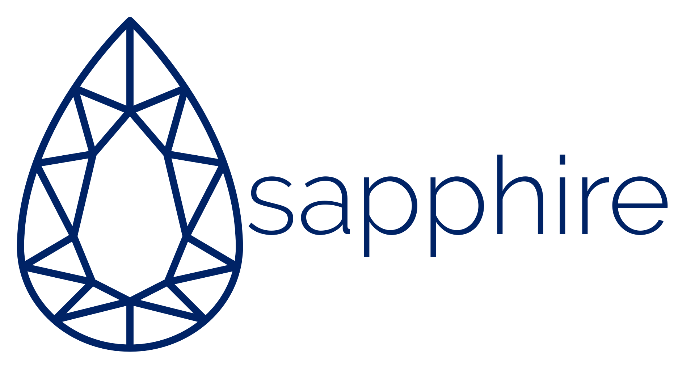

# 

Sapphire is my very own programming language, simultaneously developed as a language I would like to use and a never-ending source of things to learn.

## Goals
The goals of the project are (in some particular order):
- Create a language with a nice syntax that I would like to use.
- Constantly learn ways to improve the language.
- Learn about the kind of work that goes into developing production grade languages.
- Eventually get Sapphire to the point where it can interpret / compile itself.

## Project Details
- Written in Crystal.
    - Sapphire will work off of Crystal's GC.
    - If we decide to write the interpreter in Sapphire later, we'll then have to implement out own GC.
- Parser (will eventually be) generated using [ANTLR](http://www.antlr.org/) for Go and translated into Crystal (like the books I'll be using).
- Language will initially be interpreted, then will be compiled.
    - When the compiled version starts, the interpreted version will be archived to a protected branch.
- When language is mature enough, rewrite the interpreter, and later the compiler, in Sapphire.

## Extensions
Some basic extensions that I would like to see built in to the language itself;
- `sapphire docs`: Similar to how crystal generates documentation I would like to have Sapphire being able to parse code and generate doc pages
- `sapphire fmt`: Similar to tools like `gofmt` or `crystal tool format`, I would like it for Sapphire to have a built-in formatter (once we have a style guide in place)
- `sapphire deps`: When the language starts to grow, we would need to have some kind of dependency manager built in.

## Roadmap
Here's a basic roadmap for anyone who is interested in what's going on with this project;
- Write a basic (non-production) version of the interpreter in Crystal
- Research and learn ANTLR4 and use it to generate a better parser.
- Go through the [interpreter book](https://interpreterbook.com) and get Sapphire up and running as far as that book goes.
- Once the [compiler book](https://compilerbook.com) is released, go through that and turn Sapphire into a compiled language.
- Get Sapphire to the point where it can replace it's Crystal interpreter.
- Get Sapphire to the point where it can replace it's Crystal compiler.
- Start trying to add on the extra Sapphire tools.
- Keep improving stuff.

## Syntax Idea
The syntax is inspired by a mix of Python, Swift, Crystal and TypeScript, which ***hopefully*** leads to a nice looking syntax;

The Crystal syntax added is the use and convention of `?` and `!` methods.

An example of the syntax can be seen at https://crnbrdrck.xyz/sapphire/syntax/

## Contributing
This project is open to anyone who wants to learn anything about creating programming languages!

A goal for early stages is to keep documentation at a high enough quality that it will hopefully be easy to follow what's going on, but if not then please open an issue!
